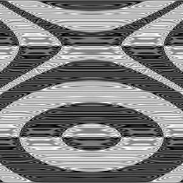

# Random Art

## Description

Create art using Python's random module and math functions.

## Tasks

```markdown
* [ ] Blank slate
  * [ ] Create a GitHub repo called `modern-art`
  * [ ] Put a `README.md` file in it
  * [ ] Copy `requirements.txt`, `create_art.py`, and `random_art.py` into it frmo this repo
  * [ ] Make sure your modern-art folder has its own virtual environment (`.envrc`), but **do not commit `.envrc` or `.direnv`**
  * [ ] Install the requirements using `pip install -r requirements.txt`
* [ ] Normal mode
  * [ ] Test create_art.py and random_art.py, and examine random_art.py to determine how art is randomly being created
  * [ ] Modify the create_expression function in random_art.py and come up with your own algorithm for generating random art
  * [ ] Run create_art.py with your new function(s) and find some awesome artwork
  * [ ] Commit at least one created artwork you particularly like, and include instructions in your `README.md` file for how to reproduce it
* [ ] Hard Mode
  * [ ] Implement an [abstract syntax tree][] or some other algorithm that requires modifying run_expression to work with
```

## Objectives

### Learning Objectives

After completing this assignment, you should understand:

* Randomness
* The Python `random` module
* The sublime beauty of generated art

### Performance Objectives

After completing this assignment, you should be able to:

* Generate images with Python
* Use randomness to construct new functions

## Details

### Deliverables

* A Git repo called random-art containing at least:
  * `README.md` file explaining how to run your project
  * a `requirements.txt` file
  * a `random_art` module
  * Your favorite piece of art you made, plus instructions
    on how to replicate it.

### Requirements  

* No PEP8 or Pyflakes warnings or errors

## Normal Mode

You are going to make random art, inspired by
[random-art.org](http://www.random-art.org/). This project comes
with a file `create_art.py`. This file expects a module called
`random_art` with two functions:

* `create_expression()`: this function takes no arguments and returns
  an expression that will generate a number between -1.0 and 1.0, given
  `x` and `y` coordinates.

* `run_expression(expression, x, y)`: this function takes an expression
  created by `create_expression` and an `x` and `y` value. It runs the
  expression, passing the `x` and `y` values to it and returns a value
  between -1.0 and 1.0.

### What's an expression?

I'm super-glad you asked! It is a way for you to create a formula for your
random art. You can define it however you like. Perhaps it's just a function
and `run_expression` just runs it. Maybe it's an [abstract syntax tree][] and
`run_expression` walks the tree and evaluates it. Maybe it's Python code in
a string that you call `eval` on. You have to figure this part out, and it's
one of the harder parts of this exercise.

### What should my expression do?

The concrete thing it has to do is take an `x` and `y` value and return a new
value between -1.0 and 1.0. That doesn't tell you why or how, though.

You should randomly construct an expression that uses `sin`, `cos`, and any
other functions you want. `sin` and `cos` will definitely help you create
patterns, but you should be creative. Look at other functions available to you
and create your own functions for use.

How you randomly construct the expression is up to you. `random.random()` and
`random.choice()` are both obvious ways to construct it, but you should look
at all the different functions for random distributions and consider them.



This image was created with the following expression:

```py
sin(pi * sin(pi * sin(pi * (sin(pi * sin(pi * sin(pi * sin(pi *
    cos(pi * y))))) * cos(pi * sin(pi * cos(pi *
    avg(sin(pi * y), (x * x)))))))))
```

[abstract syntax tree]: https://en.wikipedia.org/wiki/Abstract_syntax_tree


## Notes

`create_art.py` takes several command-line parameters you may want to use.

* `--seed SEED` sets the random seed to a particular number. This is great for
being able to generate the same image more than once.

* `-n NUM` or `--number NUM` sets how many images to create. `NUM` is 1 by
default.

* `--gray` or `--color` sets whether the image is in grayscale or color.
Color is default.

## Additional Resources

* [Random Art](http://www.random-art.org/)
* [The `random` module](https://docs.python.org/3.4/library/random.html)
* [The `math` module](https://docs.python.org/3.4/library/math.html)

## Credit

Modified from [a "nifty assignment" from the annual SIGCSE meeting](http://nifty.stanford.edu/2009/stone-random-art/).
