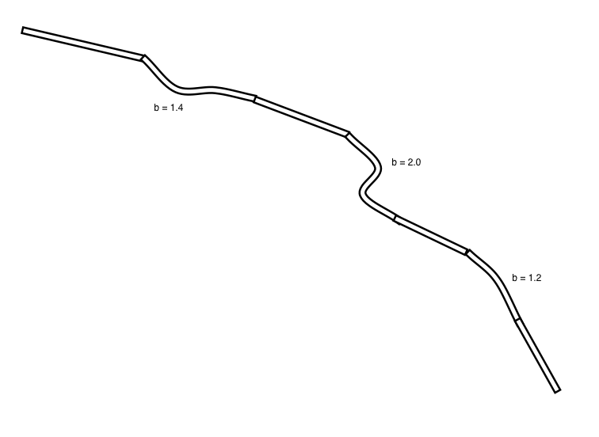

# Traffic simulation

## Description

Analyze the behavior of drivers on a new road to determine the optimal speed limits.

## Tasks
```markdown
* [ ] Blank slate
  * [ ] Create a GitHub repo called `road-rage`
  * [ ] Put `README.md` and `requirements.txt` files in it
  * [ ] Make sure `ipython[all]`, `numpy`, and any necessary plotting libraries are in `requirements.txt`
  * [ ] Make sure your `road-rage` folder has its own virtual environment (`.envrc`), but **do not commit `.envrc` or `.direnv`**
  * [ ] Install the requirements using `pip install -r requirements.txt`
* [ ] Normal mode
  * [ ] Create a module for the class or functions you are going to use for your simulation
  * [ ] Create an IPython notebook file for gathering your data
  * [ ] Import your module into your IPython notebook and gather/plot data inside of the notebook
```

## Objectives

### Learning Objectives

After completing this assignment, you should understand:

* The use of NumPy
* Complex stochastic simulations
* Basic statistical methods

### Performance Objectives

After completing this assignment, you should be able to:

* Create complex simulations
* Speak about your findings

## Details

### Deliverables

* A Git repo called traffic-simulation containing at least:
  * `README.md` file explaining how to run your project
  * a `requirements.txt` file
  * (optional) a suite of tests for your project
  * a Python package with your code
  * an IPython notebook with your findings and plots

## About the Assignment

You are going to create a simulation of traffic on a road and find the optimal speed limit for the road. In the normal mode below, this is for 1 kilometer of road. We start by listing our assumptions. These will simplify the problem from the real world.

### Assumptions

* Drivers want to go up to 120 km/hr.
* The average car is 5 meters long.
* Drivers want at least a number of meters equal to their speed in meters/second between them and the next car.
* Drivers will accelerate 2 m/s up to their desired speed as long as they have room to do so.
* If another car is too close, drivers will match that car's speed until they have room again.
* If a driver would hit another car by continuing, they stop.
* Drivers will randomly (10% chance each second) slow by 2 m/s.
* This section of road is one lane going one way.

Given all this information, create a simulation of traffic on this road. Even though the road is not circular in real life, you should treat it as such: cars exiting the road start again at the beginning. This is to simulate a continuous stream of traffic. When you start the simulation, add 30 cars to the road per kilometer, evenly spaced. Then run the simulation for one minute to get a continuous, randomized stream of traffic.

The optimal speed limit is one standard deviation above the mean speed. For ease of drivers, this should be rounded down to an integer.

Your final report should have a graph of traffic over time, showing traffic jams, as well as your recommendation for the speed limit. Add any plots that back up your analysis.

[Here is an excellent example of a graph showing traffic jams.](https://en.wikipedia.org/wiki/Nagel%E2%80%93Schreckenberg_model#mediaviewer/File:Nagel-schreck_rho%3D0.35_p%3D0.3.png)

## Normal Mode

We have a 1 kilometer section of road being built and do not know what the speed limit should be. Simulate 1 kilometer of road. As mentioned above, even though this road is not circular, treat it as such in order to generate a continuous flow of traffic.

## Hard Mode

We have a new section of road being built and do not know what the speed limit should be. This section of road is 7 kilometers long.

* Kilometer 1: straight.
* Kilometer 2: slight curve. 40% higher slowing chance.
* Kilometer 3: straight.
* Kilometer 4: curve. 100% higher slowing chance.
* Kilometer 5: straight.
* Kilometer 6: slight curve. 20% higher slowing chance.
* Kilometer 7: straight.



## Nightmare Mode

Calculate all of the above, but change your simulation to account for differing types of drivers.

Driver type      | Normal   | Aggressive | Commercial
-----------------|----------|------------|------------
Acceleration     | 2 m/s/s  | 5 m/s/s    | 1.5 m/s/s
Desired speed    | 120 km/h | 140 km/h   | 100 km/h
Vehicle size     | 5 m      | 5 m        | 25 m
Minimum spacing  | speed    | speed      | 2x speed
Slowing chance   | 10%/s    | 5%/s       | 10%/s
% of drivers     | 75%      | 10%        | 15%

* m = meters
* km = kilometers
* s = second
* h = hour

## Notes

This is incredibly similar to real work that a highway planner would do. Using these tools should highlight how randomness can be used to solve many real-world problems.

Your simulations may take quite some time to run. You should create smaller simulations and make sure they are giving you reasonable answers before scaling up.

Remember that one simulation is meaningless: you need many simulations for the law of large numbers to matter.

If you have changed a file that you're importing into IPython notebook, you may need to restart the kernel and re-run the cells to get the changes. Bceause of this, you may want to work on "rough" versions of the parts of the module inside of your notebook, and then put them in a separate module as they become more stable.

## Additional Resources

* Chapters 1 and 2 of [Monte Carlo Theory, Methods, and Examples](http://statweb.stanford.edu/~owen/mc/).
* [Traffic simulation on Wikipedia](https://en.wikipedia.org/wiki/Traffic_simulation).
